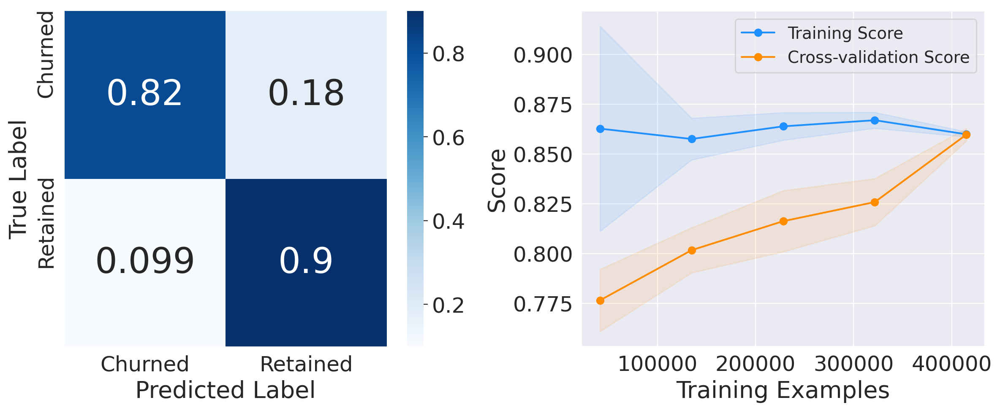
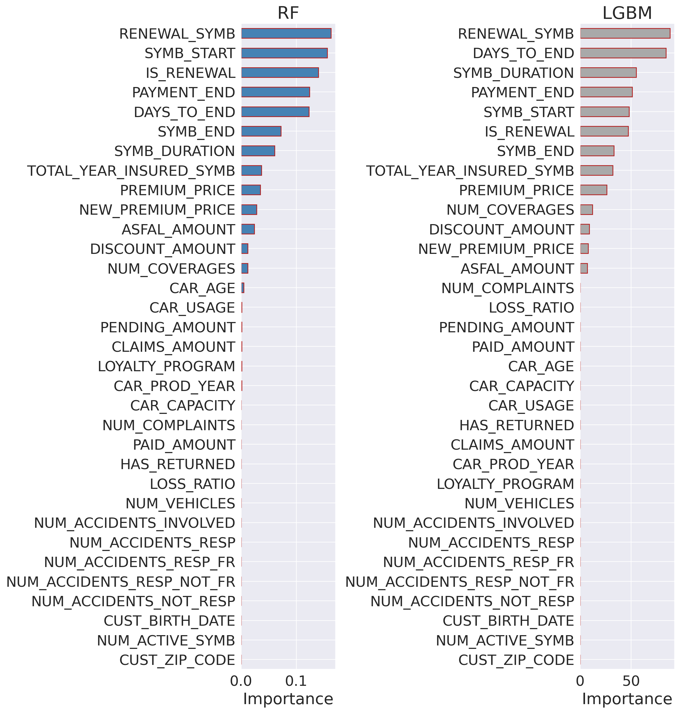

# 
## [**AI Hackathon, Athens, 2024**](https://www.hackathongreece.ai/) : **Special Challenge Distinction (3rd runner-up)**

### [Team "Quanputing"](https://github.com/qiskit-community/qiskit-hackathon-korea-21/issues/12)
| name | github | role |
|-------|--------|---------|
||||
|||Code development, Created presentation slides|
||||
||||
|Kifumi Numata|[@kifumi](https://github.com/kifumi)|Coach, Qiskit Advocate|
|Anna Phan|[@attp](https://github.com/attp)|Coach, Qiskit Advocate|
|Dohun Kim|[@yh08037](https://github.com/yh08037)|Code development - model1/model2|
|Yunseo Kim|[@Yunseo47](https://github.com/Yunseo47)|Code development - model2, Presentation|
|Jaehoon Hahm|[@Jaehoon-zx](https://github.com/Jaehoon-zx)|Create presentation slides, Presentation|
|DaeHeon Yoon|[@Greathoney](https://github.com/Greathoney)|Code development - model1, Create presentation slides|
|Yoon Kwon|[@vhapfks](https://github.com/vhapfks)|Create presentation slides|
|Eunchan Lee|[@purang2](https://github.com/purang2)|Code development - model1|

### Model 1. [Logistic Regression](https://scikit-learn.org/stable/modules/generated/sklearn.linear_model.LogisticRegression.html)
Build MNIST multi-label classifiers using classical convolution layers and quantum fully-connected layers.

### Model 2. [Random Forest](https://scikit-learn.org/stable/modules/generated/sklearn.ensemble.RandomForestClassifier.html)
Build MNIST multi-label classifiers using classical convolution layers and quantum fully-connected layers.

### Model 3. [LightGBM](https://github.com/microsoft/LightGBM)
Build MNIST multi-label classifiers using classical convolution layers and quantum fully-connected layers.

### Feature importance

## Ensembling and testing

## References
### SMOTE [Synthetic Minority Over-sampling Technique](https://arxiv.org/abs/1106.1813)
