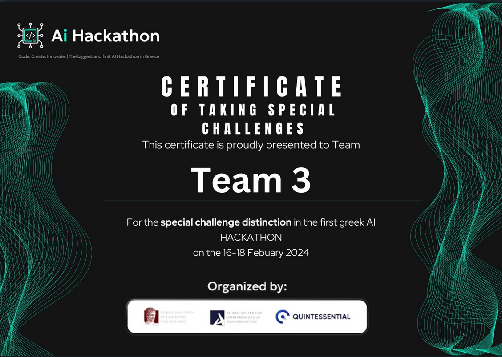
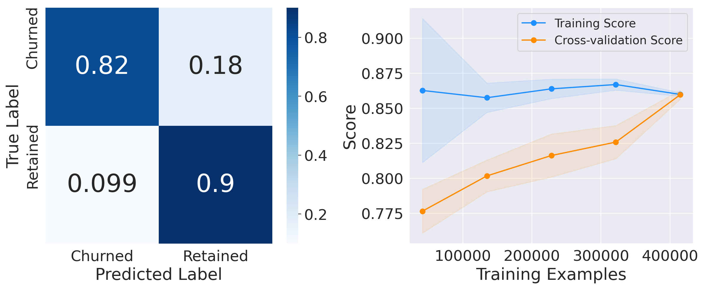
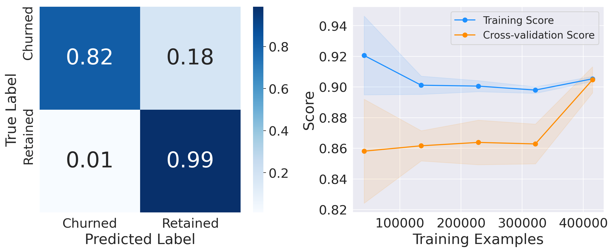
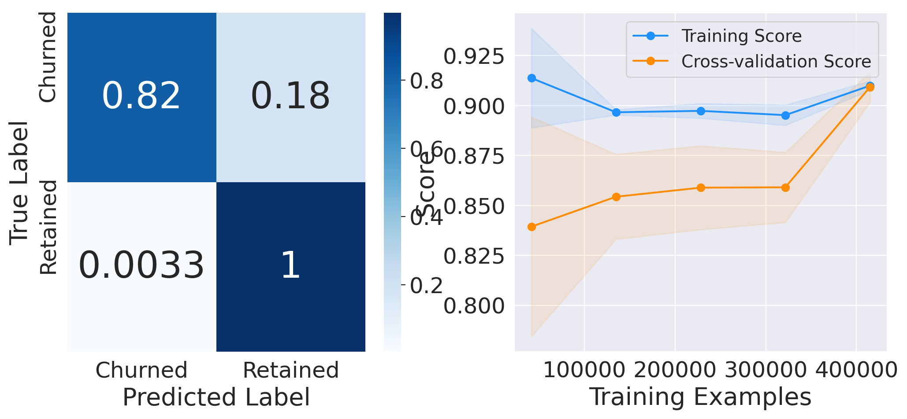
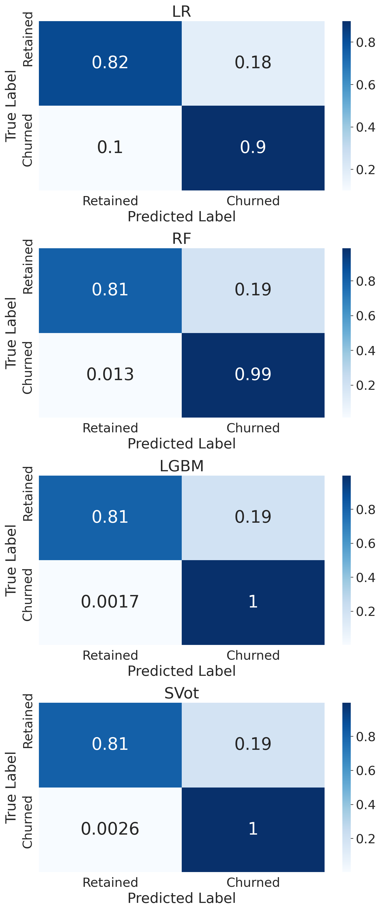

## A data-driven approach for churn-prediction of car-insurance contracts
This is a data-driven solution for churn prediction, using Oracle's dataset which was provided as a special challenge for the AI Hackathon. We used an ensemble of three machine-learning algorithms, each with its own feature engineering, to get a solution that achieved 90% accuracy for predicting whether a client is likely to churn or not.

For implementation details, have a look at the provided [notebook](churn-prediction.ipynb), while the presentation itself, can be found in the [pitch file](pitch.pdf).

## [**AI Hackathon, Athens, 2024**](https://www.hackathongreece.ai/) : **Special Challenge Distinction (3rd runner-up)**

### **Team 3**
| name | github | role |
|-------|--------|---------|
|Alexandros Fortounas|[@AlexFortounas](https://github.com/AlexFortounas)|Created presentation slides, Presentation|
|Konstantinos Vlachos|[@kostisvl](https://github.com/kostisvl)|Presentation facilitation, Created presentation slides|
|Michael Darmanis|[@mdarm](https://github.com/mdarm)|Code development, Created presentation slides|
|Panagiotis Leontis|[@pleontis](https://github.com/pleontis)|Code development - feature engineering, Created presentation slides|

### Model 1. [Logistic Regression](https://scikit-learn.org/stable/modules/generated/sklearn.linear_model.LogisticRegression.html)
Grid-search results, using 5-fold cross-validation, on logistic regression.

### Model 2. [Random Forest](https://scikit-learn.org/stable/modules/generated/sklearn.ensemble.RandomForestClassifier.html)
Grid-search results, using 5-fold cross-validation, on random forest.

### Model 3. [LightGBM](https://github.com/microsoft/LightGBM)
Grid-search results, using 5-fold cross-validation, on a light gradient-boosting machine.

## Ensembling and testing
Testing results of all models and of their Ensemble, using a soft-voting scheme.

## License 
### The MIT License  
